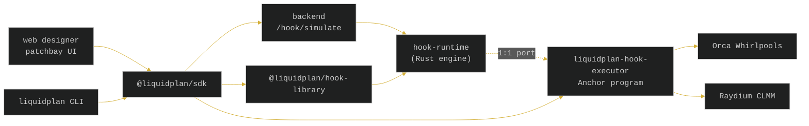

# Liquidplan

---

# CA:

# AKSYuSqinmiYt5pSQxsfb4m97seTP37s32TSs9Lpump

---

**Patch your liquidity.** Compose hooks like patching modules, then run them on
Solana CLMMs.

[](https://liquidplan.fi)
[](docs/architecture.md)
[](https://x.com/liquidplan_fi)
[](https://github.com/Liquidplandotfuns/liquidplan/actions/workflows/ci.yml)
[](LICENSE)
[](https://github.com/Liquidplandotfuns/liquidplan/stargazers)
[](crates)
[](packages)
[](programs)
[](programs/liquidplan-hook-executor)

`8/8 hooks · 59/59 tests · Orca + Raydium + Meteora · Anchor 0.31 · holder-tier burn · mainnet-live`

---

## The hook problem

Uniswap v4 made the AMM programmable: a pool can call out to a *hook* contract
at fixed points in its lifecycle — before and after initialize, add/remove
liquidity, swap, and donate — so liquidity providers can attach custom logic
(dynamic fees, gating, limit orders, MEV defenses) without forking the AMM.

Solana's concentrated-liquidity AMMs — Orca Whirlpools and Raydium CLMM — do not
expose that extension point. They do not call arbitrary programs on the swap
path, so the v4 pattern does not transfer directly.

Liquidplan brings the same idea to Solana from the **integration boundary**. A
router program or an off-chain keeper observes a pool lifecycle event, maps it
into a venue-neutral context, and calls the Liquidplan executor. Hooks decide
allow / deny / fee-override; a veto in a `before*` callback reverts the
transaction.

## How a hook evaluates

```rust
use liquidplan_hook_runtime::{builtin::DynamicFee, Hook, HookCallback, HookContext, Dex};

let fee_hook = DynamicFee::default();           // base 30 bps, max 100 bps
let mut ctx = HookContext::new(HookCallback::BeforeSwap, Dex::OrcaWhirlpool, [0u8; 32]);
ctx.amount_in = 500_000_000;                    // 0.5 SOL-equivalent

let decision = fee_hook.evaluate(&ctx);
assert!(decision.allow);
assert_eq!(decision.fee_override_bps, Some(65)); // interpolated toward the cap
```

The exact same arithmetic is ported into the Anchor program, so a backtest in
the backend and a trigger on-chain return the same fee.

## Eight built-in modules

Each module is a patch cable color in the designer; the slug is the stable
identifier shared by the runtime, the program, the SDK, and the CLI.

| Module | Slug | Category | Callbacks | What it does |
| --- | --- | --- | --- | --- |
| Dynamic Fee | `dynamic-fee` | fees | beforeSwap, afterSwap | Ramps the fee from a base to a cap using swap size as a volatility proxy |
| TimeLock | `time-lock` | timing | beforeAddLiquidity, beforeRemoveLiquidity | Blocks liquidity actions until an unlock timestamp |
| WhitelistGate | `whitelist-gate` | gating | beforeSwap, beforeAddLiquidity | Restricts actions to an allowlist (Merkle root committed on-chain) |
| RangeOrder | `range-order` | range | afterSwap | Fills a one-sided order as the tick crosses a target |
| AntiMEV | `anti-mev` | mev | beforeSwap, afterSwap | Vetoes swaps that move price past a per-block cap; credits prevented MEV |
| KYCGate | `kyc-gate` | kyc | beforeSwap, beforeAddLiquidity | Requires a verified-credential attestation before acting |
| PriceImpactCap | `price-impact-cap` | gating | beforeSwap | Rejects swaps whose estimated price impact exceeds a per-swap cap (LP-owned slippage ceiling) |
| JIT-Defense | `jit-defense` | mev | beforeSwap, beforeAddLiquidity, beforeRemoveLiquidity | Blocks same-block add-swap-remove sandwiches from one wallet (just-in-time LP attack defense) |

Folding rules when several hooks share a callback: hooks run in install order,
the first veto short-circuits, the last fee override wins, and credited MEV
accumulates.

## Architecture



The decision logic lives once as toolchain-free Rust (`crates/hook-runtime`) and
is ported 1:1 into the Anchor program. The metadata (slugs, params, cable
colors) lives once in `@liquidplan/hook-library` and is read by every other layer,
so the web designer, SDK, CLI, runtime, and program never drift.

## Repository layout

```
liquidplan/
├── crates/
│   ├── hook-runtime/     toolchain-free engine — callbacks, registry, 6 builtins
│   └── hook-adapters/    Orca / Raydium lifecycle event -> HookContext mappers
├── programs/
│   └── liquidplan-hook-executor/   Anchor program — register / install / trigger
├── packages/
│   ├── hook-library/     cross-language metadata (slugs, params, cables)
│   └── ts-sdk/           PDA derivation + params encoders + simulate client
└── docs/                 architecture · hooks-spec · security
```

## Quickstart

Build and test the Rust core (no Solana toolchain required for the engine):

```bash
git clone https://github.com/Liquidplandotfuns/liquidplan
cd liquidplan
cargo test --workspace
```

Typecheck the TypeScript packages:

```bash
cd packages/hook-library
npm install
npx tsc --noEmit
```

Encode a hook's params and derive its PDAs with the SDK:

```ts
import { LiquidplanClient, encode } from '@liquidplan/sdk';

const client = new LiquidplanClient();
const blob = encode.dynamicFee({
  baseFeeBps: 30,
  maxFeeBps: 100,
  pivotAmount: 1_000_000_000n,
});

const installation = client.installationPda(pool, 'dynamic-fee');
const result = await client.simulateHook('dynamic-fee', { baseFeeBps: 30 }, pool, 'orca', 30);
```

## Hook callbacks

Liquidplan keeps the full Uniswap v4 `IHooks` surface — ten callbacks in five
before/after pairs — mapped onto the Solana CLMM lifecycle. The discriminants
are a stable wire ABI (reused in event encoding), so they are never reordered.
The complete mapping is in [docs/hooks-spec.md](docs/hooks-spec.md).

## On-chain program

| field | value |
| --- | --- |
| Program ID | `EPcW7e8RxBNPpQK2XKoKG9maWH6QvmU3ejxifoU5rNRa` |
| Cluster | devnet (mainnet pending) |
| Explorer | [explorer.solana.com](https://explorer.solana.com/address/EPcW7e8RxBNPpQK2XKoKG9maWH6QvmU3ejxifoU5rNRa?cluster=devnet) |

The hook executor is deployed on devnet for end-to-end testing of the
register / install / trigger flows. The mainnet deployment ships with a funded
keypair.

## LIQUIDPLAN burn tiers

`install_hook_burning` (the default path used by `liquidplan-cli install`) burns
a tier-derived amount of LIQUIDPLAN from the installer's wallet on every call.
The tier is a pure function over the installer's share of total
`LIQUIDPLAN_MINT` supply — holding is the discount.

| Tier | Holder share of supply | Burn per install |
| ---- | ---------------------- | ---------------- |
| T1   | ≥ 2.0%                 | 100 LIQUIDPLAN       |
| T2   | ≥ 1.0%                 | 300 LIQUIDPLAN       |
| T3   | ≥ 0.5%                 | 1,000 LIQUIDPLAN     |
| T4   | ≥ 0.1%                 | 5,000 LIQUIDPLAN     |
| T5   | < 0.1%                 | 50,000 LIQUIDPLAN    |

The mint's `mintAuthority` and `freezeAuthority` are both `null`, so burn
is a permanent supply reduction and no party can freeze a holder's account.
The legacy `install_hook` instruction is preserved; pass `--no-burn` to
opt out of the burn path. Full spec in
[docs/token-economics.md](docs/token-economics.md).

Quote any wallet against live mint supply:

```bash
npm i -g liquidplan-cli@latest
liquidplan tiers --wallet <your-wallet-pubkey>
```

## Status

- Engine and adapters: complete, unit-tested (`cargo test --workspace`).
- Anchor program: deployed on devnet (Anchor 0.31); mainnet deploy pending.
- The program has not had a third-party audit — see
  [docs/security.md](docs/security.md) before custodying funds.

## References

- Adams, H. et al. *Uniswap v4 Core* whitepaper, Uniswap Labs, 2024 —
  <https://app.uniswap.org/whitepaper-v4.pdf>
- Uniswap v4 hooks documentation —
  <https://docs.uniswap.org/contracts/v4/concepts/hooks>
- Orca Whirlpools documentation —
  <https://dev.orca.so>
- Raydium CLMM documentation —
  <https://docs.raydium.io>
- Anchor framework (PDA + account model) —
  <https://www.anchor-lang.com>

## License

MIT — see [LICENSE](LICENSE).
